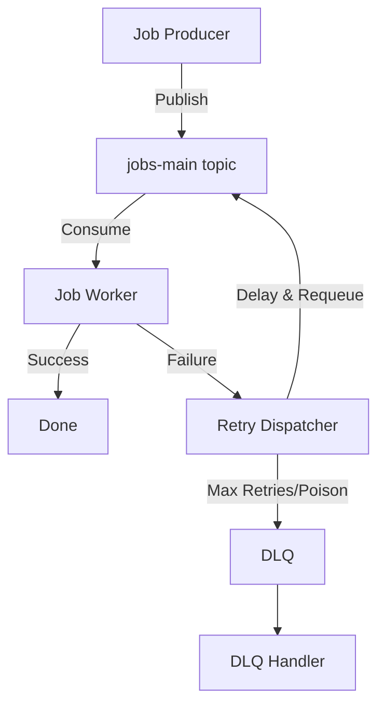
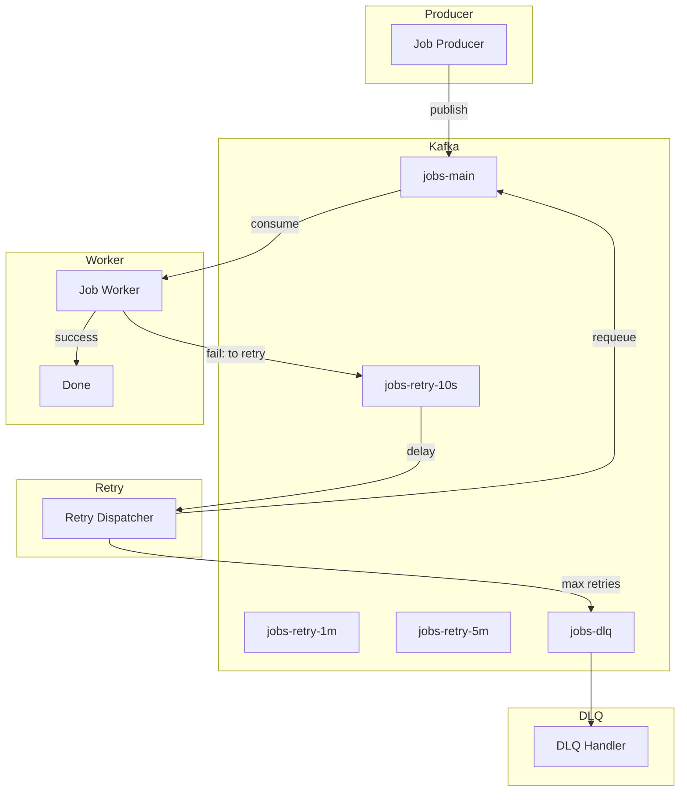

# Chrono Queue: Production-Grade Delayed Job & Retry Queue on Kafka

Kafka does **not** support delayed messages natively (unlike SQS, RabbitMQ with TTL, etc.), but almost every real system needs delayed retries: payment retries, webhook retries, email retries, job scheduling, and more.

**Chrono Queue** is a production-ready, monorepo-based system that implements delay and retry semantics on top of Kafka, using Spring Boot, Redis, and Docker. It demonstrates advanced distributed systems patterns, real-world Kafka usage, and robust failure handling.

---

## 🚀 Features

- True delayed job and retry queue on Kafka (no broker plugins)
- Topic-based retry chaining with exponential backoff
- Dead Letter Queue (DLQ) for poison messages and max retries
- Idempotency and job locking with Redis
- Horizontally scalable, stateless microservices
- Complete observability stack (Grafana, Loki, Promtail)
- Docker Compose for local development
- Clean monorepo structure for easy extension

---

## 🏗️ Complete Project Structure

```
chrono-queue/
├── README.md
├── docker-compose.yml
├── .env
├── common/
│   ├── pom.xml
│   └── src/main/java/com/chrono/common/
│       ├── model/
│       │   └── JobEventModel.java
│       ├── enums/
│       │   └── JobStatus.java
│       └── ...
├── job-producer/
│   ├── Dockerfile
│   ├── pom.xml
│   └── src/main/java/com/chrono/jobproducer/
│       ├── controller/
│       ├── service/
│       └── config/
├── job-worker/
│   ├── Dockerfile
│   ├── pom.xml
│   └── src/main/java/com/chrono/jobworker/
│       ├── consumer/
│       ├── service/
│       └── config/
├── retry-dispatcher/
│   ├── Dockerfile
│   ├── pom.xml
│   └── src/main/java/com/chrono/retrydispatcher/
│       ├── consumer/
│       ├── scheduler/
│       └── producer/
├── dlq/
│   ├── Dockerfile
│   ├── pom.xml
│   └── src/main/java/com/chrono/dlq/
│       ├── consumer/
│       └── service/
├── grafana/
│   └── provisioning/
│       ├── datasources/
│       └── dashboards/
├── promtail-config.yml
├── loki-config.yaml
├── ...
```

---

## 🧠 Architecture & Working

### System Diagram



### Component Roles

- **Job Producer**: REST API for submitting jobs, publishes to Kafka.
- **Job Worker**: Consumes jobs, executes business logic, uses Redis for idempotency/locking, sends failed jobs to retry topics.
- **Retry Dispatcher**: Consumes from retry topics, applies delay (sleep/schedule), re-publishes to main topic.
- **DLQ Handler**: Consumes from DLQ, logs/alerts, enables manual replay.
- **Redis**: Used for idempotency, job locks, retry metadata, and metrics.
- **Kafka Topics**: Main, retry (multiple delays), and DLQ topics.
- **Grafana/Loki/Promtail**: Observability stack for logs and dashboards.

---

## 🛠️ Tech Stack

- **Java 17+**
- **Spring Boot** (microservices, Kafka, Redis integration)
- **Apache Kafka** (core queueing)
- **Redis** (idempotency, locks)
- **Docker & Docker Compose** (local orchestration)
- **Grafana, Loki, Promtail** (logs & dashboards)

---

## ⚙️ Algorithms & Implementation Details

### 1. **Delayed Retry via Topic Chaining**
- Each retry delay (10s, 1m, 5m, etc.) has its own Kafka topic.
- On failure, jobs are sent to the next retry topic with incremented `retryCount`.
- Delay is enforced by the consumer (not Kafka itself):
    - Consumer reads message, sleeps/schedules for delay, then republishes to main topic.

### 2. **Idempotency & Locking**
- Redis `SETNX` is used to ensure a job is only processed once.
- Job locks prevent parallel execution of the same job.

### 3. **DLQ Handling**
- If `retryCount` exceeds max or a poison message is detected, job is sent to DLQ.
- DLQ handler logs, alerts, and enables manual replay.

### 4. **Observability**
- All logs are shipped to Loki via Promtail.
- Grafana dashboards provide API, error, and log insights.

---

## 📦 Kafka Topic Layout

| Topic Name     | Purpose           |
|--------------- |-------------------|
| jobs-main      | Primary execution |
| jobs-retry-10s | Short retry       |
| jobs-retry-1m  | Medium retry      |
| jobs-retry-5m  | Long retry        |
| jobs-dlq       | Permanent failure |

Partition key: `jobId` (ensures ordering per job)

---

## 🧩 Use Cases

- Payment/webhook/email retries with backoff
- Scheduled background jobs
- Distributed job execution with idempotency
- Failure debugging and alerting via DLQ

---

## 📝 Features Implemented

- REST API for job submission
- Kafka-based job queueing and retry
- Exponential backoff via topic chaining
- Redis-powered idempotency and job locks
- DLQ for poison messages and max retries
- Grafana dashboards for logs and metrics
- Docker Compose for full local stack

---

## 🧪 Failure Scenarios Handled

- Consumer crash after processing (idempotency)
- Duplicate message processing (Redis lock)
- Consumer rebalance (cooperative rebalancing)
- Poison messages (DLQ)

---

## 📊 Observability: Logs & Dashboards

- **Loki**: Aggregates logs from all containers
- **Promtail**: Ships logs to Loki
- **Grafana**: Visualizes logs and metrics

Dashboards auto-provisioned at startup:
- API Endpoints (request rate, logs)
- Logs Overview (service log volume, live logs)
- Error Monitoring (error rate, error logs)

---

## 🧾 Resume-Ready Description

> Designed and implemented a production-grade delayed job and retry queue system on Kafka using topic-based retry chaining, consumer-controlled delays, idempotent processing with Redis, and robust DLQ handling. Delivered full observability with Grafana and Loki, and containerized the stack for local and production use.

---

## 📚 Further Improvements

- Add MySQL/Postgres for audit logs
- Add Kubernetes manifests for cloud-native deployment
- Implement advanced alerting (PagerDuty, Slack)
- Add authentication/authorization to APIs

---

## 📈 Architecture Diagram



---

## 💡 Why This Project Stands Out

- Real-world distributed systems patterns
- Clean separation of concerns
- Scalable, observable, and production-ready
- Interview-ready architecture and code

---
